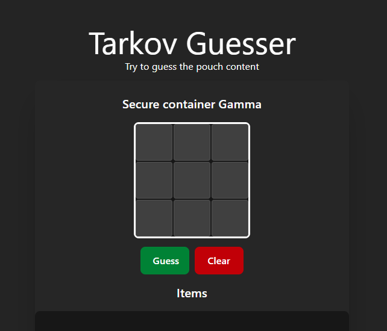

# Tarkov Guesser
Tarkov Pouch Guesser is a game based on the video game Escape from Tarkov where you have to guess the contents of the pouch by placing the objects in the correct order. The secret contents of the pouch change daily.

[Game link](https://tarkov.joselp.com/)



Any suggestions or reports can be sent through the contact information found at [my personal website.](https://joselp.com/)

## Run the app
We can easily run the whole with only a single command:
```bash
docker compose up
```
## Env files
You must create a /ui/.env file with the following variables

```bash
MONGODB_USER=
MONGODB_PASSWORD=
MONGODB_DATABASE=
MONGODB_LOCAL_PORT=
MONGODB_DOCKER_PORT=

SPRING_LOCAL_PORT=
SPRING_DOCKER_PORT=
```
